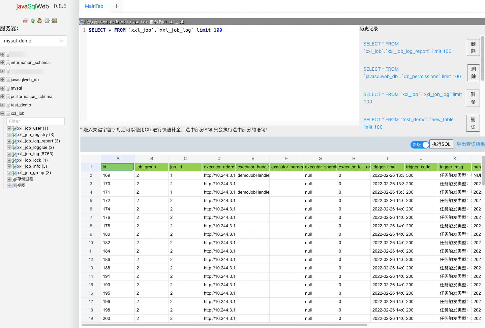
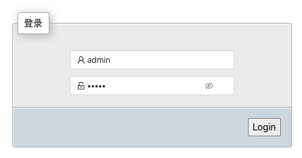
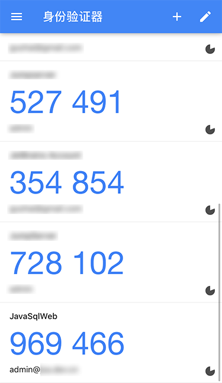
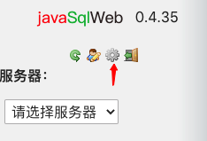
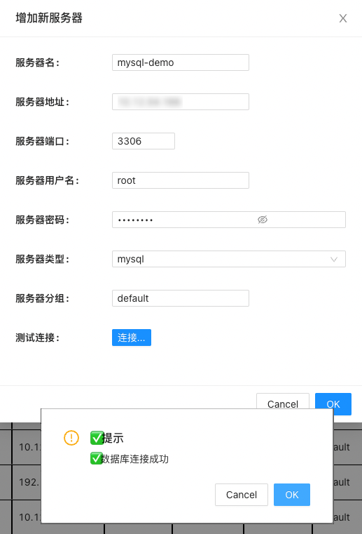
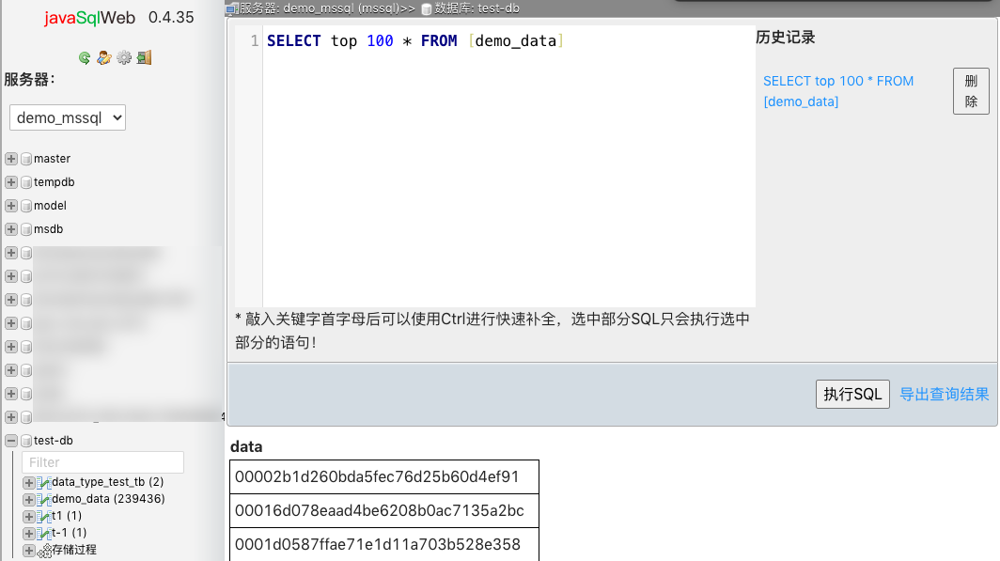

# JavaSqlWeb - 一个运营环境数据查询系统




## 项目介绍

所有企业都面临的一个需求就是需要开发人员连接线上生产库，但又担心开发人员查询线上敏感数据甚至拖库。一般做法都是：

1. 通过限制查询人员、限制查询的表和字段。
2. 使用跳板机，所有查询都要在跳板机上进行。进出数据文件要过审查机制。
3. 使用第三方系统，记录每人的查询语句。

从上向下规则是越来越严。第一级直接由DBA进行查询账号权限限制即可，第二级推荐使用开源的[JumpServer](https://github.com/jumpserver)。第三级我在网上搜了下发现基本都是基于WEB系统，查询语句入库。但能支持的数据库只有MySql没有发现开源的能只是微软家SqlServer的。本项目就是在这个基础上开始准备开发的。

## 项目部署

### 环境安装

本项目使用Reactjs+Springboot+mysql的组合。最简项目运行可以使用Docker来运行。

```shell
# 首先下载数据库初始化脚本 
wget https://github.com/guohai163/java-sql-web/raw/master/script/init.sql
# 按初始化脚本编辑修改.sql文件。
vim init.sql
# 启动数据库容器,把刚下载好的init.sql文件映射到容器里的docker-entrypoint-initdb.d目录下。为了启动容器自动创建我们需要的库和表。参数MYSQL_ROOT_PASSWORD后为数据库root用户密码，请更换成更安全的
docker run --name jswdb -v /opt/java-sql-admin/script:/docker-entrypoint-initdb.d -e  MYSQL_ROOT_PASSWORD=my-secret-pw -d mariadb:10
# 启动javasqladmin容器
docker run --name javasqlweb -d --link jswdb -p 80:8002 gcontainer/java-sql-web:0.4.22 
docker run --name jsw_web1 --rm --link jswdb:db -p 80:8002 -e MARIADB_PORT_3306_TCP_ADDR=db,MARIADB_ENV_MYSQL_ROOT_PASSWORD=my-secret-pw repo.gydev.cn:8082/gyyx/javasqlweb:0.4.35
# 使用浏览器访问 
open http://localhost
```

### 系统使用

1. 使用浏览器打开上一步容器安装的机器IP。默认用户名密码为admin/admin。点击登录

2. 为了保证系统的安全，首次登录我们需要绑定OTP动态码，可以点击下载安卓或iOS版本客户端。安装好后扫码即可得到6位的动态码。之后每次登录不用绑定但依然要输入6位动态码。



3. 进入主界面后我们先进入后台进行基本的设置管理。


4. 首选我们看如果增加服务器，选择服务器管理=>增加服务器。在弹出层中添加你的服务器相关信息。


5. 我们顺便给平台在增加一个用户。点击账号管理=>增加用户，在弹层内输入新用户的账号和密码即可。
6. 我们返回前台，看看主界面，主界面分为左右两部分，左侧主要为数据库表的导航。右侧主要为SQL书写区，执行结果展示区。

  需要注意的是：

    1. 左侧库下面的表的数据信息部分会进行客户端本地缓存，缓存时长为24小时。可能表的行数不会实时返回到页面上。
    2. 右侧的SQL输入区支持SQL语法的快速补全，按下键盘的Ctrl键即可进行补全。
    3. 历史记录区域会按服务器进行区分，并也缓存在本地。换浏览器后历史记录不会带走请注意。
    4. 对于查询结果，配置文件中可以进行限制一次最大返回条数，如果查询数据超过最大返回条数，客户端会进行弹层提示。
    5. 点击存储过程，可以快速查看存储过程的创建语句。

7. 后台日志：经过几次的试用可以去往后台的查询日志。可以看到用户的数据执行情况。

## 目前支持的功能列表

1. 账号登录，强制二次验证【OTP】。目前没有后台系统创建账号还需要依赖直接写SQL语句
2. 查询的目标数据库支持SqlServer和MySql
3. 后台会记录每次SQL执行脚本
4. 支持查询结果的csv格式导出
5. 脚本输入框语法高亮，智能提醒
